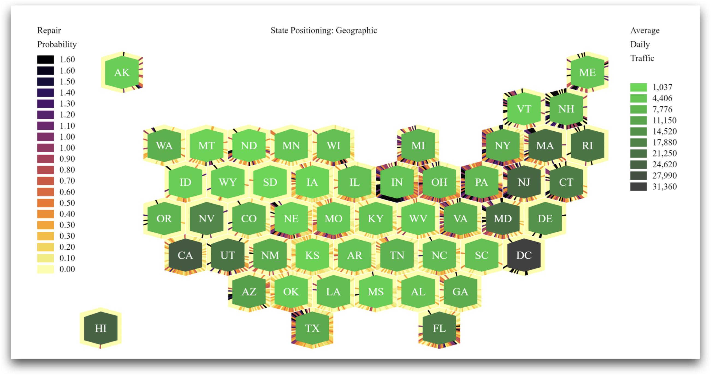
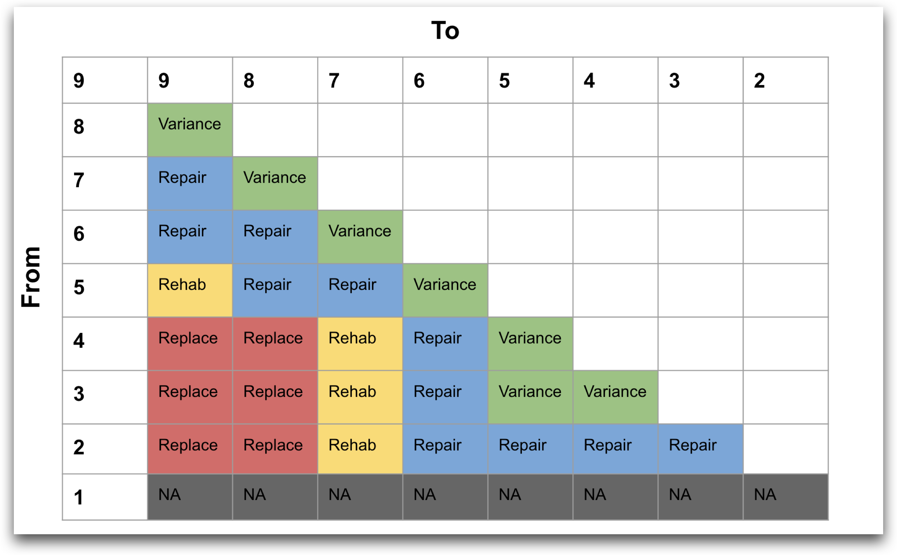

<h1 align='center'>
🌉  Bridge Actuarial Analysis 
</h1>

<b> Actuarial demonstration by Dr. Brian Ricks and Mr. O'Brien Chin </b> 

Bridges are critical infrastructure whose maintenance is a key responsibility for both government and private organizations. Costly to build and repair, bridges are valuable assets that can benefit from improved predictive maintenance. In this work, we present a novel, straightforward, non-parametric method for doing so based on actuarial life tables.

### 🎯 Objective

The objective of this research study is to develop a measure / method for computing bridge maintenance frequency.

### 💪 Challenge

In the NBI dataset, it is a **challenge** to identify maintenance patterns. Because, the use of `reconstruction_year` within the NBI inspection records does not provide an valuable information about the type of repair or reconstruction done.

### 🧪 Solution

 To address this challenge we can use bridge intervention matrix, that utilizes the bridge intervention matrix for `deck` to identify various types of intervention depending on the probability of the transition.
 

<b> Developed in collaboration with by Mr. Kent Miller (NDOT)</b> 

### 👉 References

| Document      | Documentation type | Description |
| ------------- | ------------------ | ----------- |
| [Quickstart](docs/quickstart.md) | Reference | An overview and guide to setup this project |
| [Methodology](docs/methodology.md) | Concept, Reference | Simplest possible method for implementing our proposed method |
| [Functions](docs/functions.md) | Reference | List of references for the functions used|
| [Related Projects](docs/related-projects.md) | Reference | List of projects related to this repository |
| [Data](docs/data.md) | Reference | List of data items used in implementing this projects |

