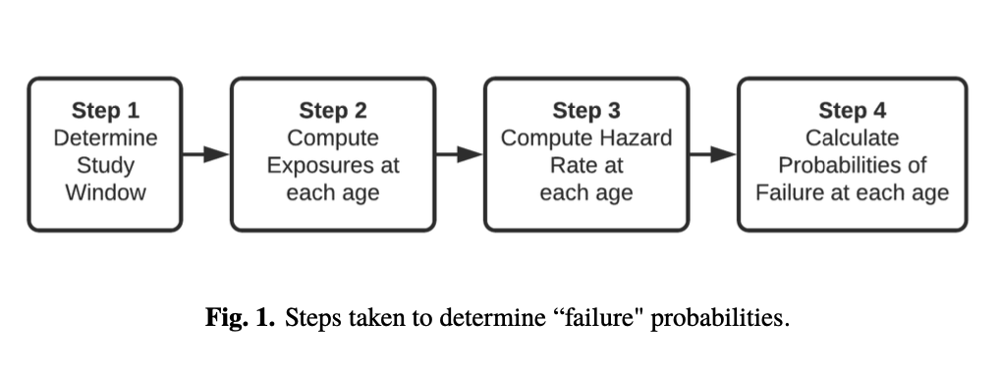

<h1 align='center'>
      Method by O'Brien Chin 
</h1>
        
## Data 
* **Source:** National Bridge Inventory
* **Timeline:** 1992 to 2021
* **Scope:** All U.S. states 🇺🇸
* 👉 [**Data acqusition and transformation**](https://github.com/kaleoyster/nbi/tree/b5fb41950ee0a44c1d8967a1a672c0e3ea47b07f)

### Process for computing the failure probability

<b align='center'>Figure 1: The version 1 life-table research methodology</b>

There are four steps to computing failure probabilities using this method:

1. Select study window 
2. Compute exposure at each age 
3. Compute Hazard rate at each age
4. Calculate the probability of failure at each age

#### 🪟 1.  Select study window

- The general concept of this approach is to establish a study period and observe the behavior of the bridges as they pass through this window.
- For this study, we have compared the performance of the bridges with respect to several different chosen windows as five years, across the available time line from 1992 to 2021: for intance one study window might be 2013 to 2017, inclusively. 
- This selection was based on the length of our available time series data; yet in general, a different window can be chosen for longer or shorter time series data.

#### ☢ 2. Exposures 

- Exposures represent how many bridges of each age are available to “fail" (require maintenance in the bridge case). 
- For example, if there are 100 bridges aged 35, and 50 bridges aged 40 in the study, then the exposure for ages 35 and 40 are 100 and 50, respectively.
- To compute the exposures, we need to know the age of each bridge in the study.
- The counts for each age are incremented regardless of when in the five years in the study window a bridge reaches that age. For example, if a bridge is 45 years old in 2013 and another bridge is also 45 years old in 2016, both bridges are counted as exposures for age 45.

#### ☣️  3. Hazard rate (Conditional probability of maintenance)

- Hazard function is also referred to as the force of mortality, or also thought as the instantaneous rate of failure.
    * For a very small change in time $x$, the probability that a life who has attained age $x$, fails before attaining age $x + dx$.
    * However, computing this instantaneous rate of failure requires that a bridge be part of the study for the entire year for it to contribute to the exposures for that year.
    * This requirement reduces the number of observations in the dataset (Richards 2011). 
- In contrast, we use a simpler maximum likelihood estimator that can accommodate partial year exposures to capture maintenance patterns.

#### ☁️  4. Probabilities

- Instead of the computing the absolute number of surviving bridges at age $x$ life tables commonly compute a probability of survival. 
- The probability of survival for bridges exposed from age 1 to age $x$ is:  $_1P_x$, or simply $P_x$. 
- It is computed from the hazard rate as shown in Equation 3:
- The mortality rate (or cumulative probability of failure), $F(x)$ of bridges exposed at age 1
before reaching age $x$ is then calculated from the probability of survival, as shown in Equation 4:
$$F(x) = 1 − _t(P(x))$$
- Note that $F(x)$ can also be expressed as $_1Q_x$ or simply $Q_x$. $_1Q_1$ is the cumulative probability of failure within the next year. $_1Q_1$ is computed from the probabilities of surviving within the next year $_1P_1$ and subtracting that from 1. Similarly, the probability of failure for years two, three, four, and five are computed. These are $_2Q_1$, $_3Q_1$, $_4Q_1$, $_5Q_1$ respectively.
- $_4Q_1$ and $_5Q_1$ respectively. These relationships are shown in Equation 5.
    $$ _1Q_1 = 1 - _1P_1 $$
    $$ _2Q_1 = 1 - _2P_1 $$
    $$ _3Q_1 = 1 - _3P_1 $$
    $$ _4Q_1 = 1 - _4P_1 $$
    $$ _5Q_1 = 1 - _5P_1 $$

#### 💡 Conceptual overview of the essential actuarial functions

A period life table is based on the mortality experience of a population during a relative short period of time. 
- **The probability distribution of when you will die.**
    - $f(x):$ Starting at the start time, 
        - The number of the surviving years.
        - Total life expectancy.
        * $T_x$ Total number of years lived from age $x$

- $F(x):$ Just the cumulative distribution, at time $T$, **what % of the population will be dead?** 
    - **The conditional probability of death $q_x$ = $D_x \over (P_x + (0.5 * D_x)))$**

- $S(x):$ $1-F(x)$, at time $T$, **what % of the population will be alive?**
    - **The conditional probability of survival $p_x = 1 - q_x$**

- $h(x):$  Hazard function, at a given time $T$, of the people still alive, this can be used to estimate **how many people will die in the next time interval, or if interval → 0, `instantaneous` death rate.**
    - **Hazard rate:** It measures the total amount of risk that has been accumulated up to time t.
    - **Count data interpration:** `It gives the number of times we would expect to observe failures over a given period, if only the failure events were repeatable`

- $H(x):$ Cumulative hazard function.

| Item           | Description                                                                                                    |
| -------------- | -------------------------------------------------------------------------------------------------------------- |
| $leave(x)$     | The number of bridges that leave the study at age $x$                                                          |
| $exposures(x)$ | The number of bridges in the study at age $x$                                                                  |
| $h(x)$         | Hazard rate age $x$.                                                                                           |
| $S(x)$         | Survival rate age $x$.                                                                                         |
| $F(x)$         | The mortality rate (or cumulative probability of failure) of bridges exposed at age 1 before reaching age $x$  |
| $_yP_1$        | Probability of survival at age $y$ for the next year.                                                          |

