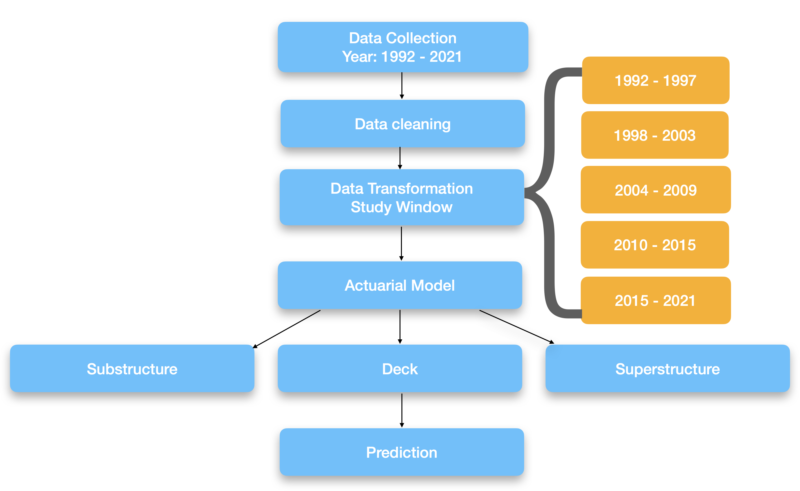

<h1 align='center'>
Methodology 🧭
</h1>

 <b>Figure 1: Research methodology of the study</b>

## Data 

* **Source:** National Bridge Inventory
* **Timeline:** 1992 to 2021
* **State:** All U.S. states 🇺🇸
* 👉 [**Data acqusition and transformation**](https://github.com/kaleoyster/nbi/tree/b5fb41950ee0a44c1d8967a1a672c0e3ea47b07f)

## Assumptions

* What is the average time-span before there
- When a maintenance event occurs on a bridge and that maintenance event is recorded, the bridge is permanently removed from the study. 
- There are other options on how to handle a bridge once a maintenance event occurs, each with its own consequences. These include:
    - Allow the bridge to re-enter the study at the same age.
    - Allow the bridge to re-enter the study at a younger age, given the type of maintenance which occurred.

## 📝 There are few consideration regarding the computation of the actuarial model

1. We need to find the appropriate length of the study window.
    - Determining the appropriate length of the study window using historical evidence.
        - For all the bridges built in the year from 1992 to 2010. Determine the average time for first major intervention.
        - Out of 17,536 bridges, only 2 % of the bridges are built in 1992.
        * And, a total of 4,479 bridges (~35%) bridges were built in between 1992 to 2020.
        * For 333 bridges built in 1992, only 77 (23%) of the bridges have any intervention, moreover, the average length is 4.79 years before intervention, max(26), min(1), and median is 2.
        * Mean and median time before intervention in these bridges.
    - Do we need to have variable study window, as the the mortality rate of observing one intervention changes over a period of time?
    * There are revised considerations for each of the study window:
        - Overall, the idea of study window of last four-years or last-three years, would guide in calculating lifetable. Each of the study window will provide an understanding of changing life expectancy of the bridges.
    *  In an attempt to find the most appropriate study window:
        - Can we bridge the all bridges around this four year time together, and treat them as bridges built in within a study window.

2. There are challenges in understanding the true mortality of the bridges as not all bridges are tracked every year over the their life cycle.
    - However, due to the inconsistent year built data, where year built of the bridges change over a period of time. One might observe that number of records available may be higher than expected.
    - For instance in 2022, a bridge built in 2014, may have a total of 29 records as opposed to 9 records.

3. Identifying the interventions from the NBI inspections records have been a major challenge Bridge Intervention Matrix (BMI):
    - Since bridge assessment is subjective, there can be various inspection variance, on top of repair and reconstruction. 
4. Computing the $_tP_x$ for all
5. In computing the life table statistics, there is a very narrow range ages, that we can compute the statistics. 

## Previous understanding of the methodology

- Instead of the computing the absolute number of surviving bridges at age $x$ life tables commonly compute a probability of survival. 
- The probability of survival for bridges exposed from age 1 to age $x$ is:  $_1P_x$, or simply $P_x$. 
- It is computed from the hazard rate as shown in Equation 3:
- The mortality rate (or cumulative probability of failure), $F(x)$ of bridges exposed at age 1
before reaching age $x$ is then calculated from the probability of survival, as shown in Equation 4:
$$F(x) = 1 − _t(P(x))$$
- Note that $F(x)$ can also be expressed as $_1Q_x$ or simply $Q_x$. $_1Q_1$ is the cumulative probability of failure within the next year. $_1Q_1$ is computed from the probabilities of surviving within the next year $_1P_1$ and subtracting that from 1. Similarly, the probability of failure for years two, three, four, and five are computed. These are $_2Q_1$, $_3Q_1$, $_4Q_1$, $_5Q_1$ respectively.
- $_4Q_1$ and $_5Q_1$ respectively. These relationships are shown in Equation 5.
    $$ _1Q_1 = 1 - _1P_1 $$
    $$ _2Q_1 = 1 - _2P_1 $$
    $$ _3Q_1 = 1 - _3P_1 $$
    $$ _4Q_1 = 1 - _4P_1 $$
    $$ _5Q_1 = 1 - _5P_1 $$

#### 🪟  Select study window

- The general concept of this approach is to establish a study period and observe the behavior of the bridges as they pass through this window.
- For this study, we have compared the performance of the bridges with respect to several different chosen windows as five years, across the available time line from 1992 to 2021: for intance one study window might be 2013 to 2017, inclusively. 
- This selection was based on the length of our available time series data; yet in general, a different window can be chosen for longer or shorter time series data.

#### ☢ Exposures / available records number of observations in the study window  

- Exposures represent how many bridges of each age are available to “fail" (require maintenance in the bridge case). 
- For example, if there are 100 bridges aged 35, and 50 bridges aged 40 in the study, then the exposure for ages 35 and 40 are 100 and 50, respectively.
- To compute the exposures, we need to know the age of each bridge in the study.
- The counts for each age are incremented regardless of when in the five years in the study window a bridge reaches that age. For example, if a bridge is 45 years old in 2013 and another bridge is also 45 years old in 2016, both bridges are counted as exposures for age 45.

## ☣️  Hazard rate / Conditional probability of maintenance

- Hazard function is also referred to as the force of mortality, or also thought as the instantaneous rate of failure.
    * For a very small change in time $x$, the probability that a life who has attained age $x$, fails before attaining age $x + dx$.
    * However, computing this instantaneous rate of failure requires that a bridge be part of the study for the entire year for it to contribute to the exposures for that year.
    * This requirement reduces the number of observations in the dataset (Richards 2011). 
- In contrast, we use a simpler maximum likelihood estimator that can accommodate partial year exposures to capture maintenance patterns.

**New improved formulation**
    - Formulation $q_x = (D_x \over (P_x + (0.5 * D_x)))$

**Work on this**
- Hence, if $leave(x)$ is the number of bridges that leave the study at age $x$ and $exposures(x)$ is the number of exposures at age $x$ 

The hazard rate is defined as the following:
$$ h(x) = {exposures(x + 1) \over exposures(x)} $$

The survival rate $S(x)$ can be computed as show in the equation 2:
$$ {S(x) = 1 - h(x)}$$

## ⚙️  The overview of the proposped method / algorithm

The following is the new approach:
    - For each window, create a life table for each study window.
    * **Study window 1:** 
        - 1992 - 1998 → defined by `BIM` → Compute average length, treating the each study window mortality rate as a baseline.
        - Compute:
            1. Death rate $(m_x)$
            2. Conditional probability of maintenance $(q_x)$
                - Based on the actuarial science, probability of death
                    - Formulation $q_x = (D_x \over (P_x + (0.5 * D_x)))$
            3. Conditional probability of survival without maintenance $(p_x)$
            4. Number of bridges surviving to age $l_x$ to age $x$
            5. Based on the study window, we can compute the $_tP_x$ for each age.
            6. Compute bridge years lived at age x $(L_x)$
            7. Compute total years lived from age x $(T_x)$
            8. Compute life expectancy $e_x$

    * **Study window 2:** 1998 - 2004
    * **Study window 3:** 2004 - 2008 
    * **Study window 4:** 2008 - 2012
    * **Study window 5:** 2012 - 2016
    * **Study window 6:** 2016 - 2020
    * and so and so forth.

- Using the mortality rate / survival rate as the baseline may prove complementary to the BDS score:
    - Baseline difference score accounts for performance of the bridge health
    - The baseline based on mortality may account for maintenance.
    * However, the maintenance based baseline may not be useful in computing a score. 

- When using the mortality rates as baseline:
    - Does computing with a denominator of 0 useful / valid as concluding 0 for life-table.
    - Zero in the denominator suggest that there are no available records for that age. That doesn't necessarily translate to no deaths.

- It would be much more wiser to have an instantaneous rate of failure for several study windows. These study windows are four years apart.
- The study windows represent bridges built during these time windows and then surviving for the next windows.

2. The hazard rate computes instantaneous rate of failure.
3. **Focus:** The study needs to focus on one single component of the bridge such as `deck`.
4. **Definition:** We need to define repair and reconstruction. This could be defined using the `Bridge Intervention Matrix`.
    - Instead of calling the death of the bridge, we can introduce a term `deterioration until maintenance`. Do we need to compute the total number of deterioration until maintenance?

5. **Correct span for the study window:** By referring to older literature, we can identify the study windows. 
    → **Research question: How to find the appropriate span for the study window using data driven methods?**

6. **Application:** This methodology can guide in answering the questions regarding the `average daily traffic` effect on the `deck` repair and maintenances.

#### 💡 Conceptual overview of the essential actuarial functions

| Item           | Description                                                                                                    |
| -------------- | -------------------------------------------------------------------------------------------------------------- |
| $leave(x)$     | The number of bridges that leave the study at age $x$                                                          |
| $exposures(x)$ | The number of bridges in the study at age $x$                                                                  |
| $h(x)$         | Hazard rate age $x$. See equation 1                                                                            |
| $S(x)$         | Survival rate age $x$. See equation 2                                                                          |
| $F(x)$         | The mortality rate (or cumulative probability of failure) of bridges exposed at age 1 before reaching age $x$  |
| $_yP_1$        | Probability of survival at age $y$ for the next year. See Equation 5                                           |

#### ☁️  Probabilities

A period life table is baed on the mortality expeirence of a population during a relative short period of time. 

#### New understanding of the methodology

- $f(x):$ Starting at the start time, the probability distribution of when you will die.
- $F(x):$ Just the cumulative distribution, at time $T$, what % of the population will be dead?
- $S(x):$ $1-F(x)$, at time $T$, what % of the population will be alive?
- $h(x):$  Hazard function, at a given time $T$, of the people still alive, this can be used to estimate how many people will die in the next time interval, or if interval → 0, `instantaneous` death rate.
    - Hazard rate: It measures the total amount of risk that has been accumulated up to time t.
    - Count data interpration: `It gives the number of times we would expect to observe failures over a given period, if only the failure events were repeatable`
- $H(x):$ Cumulative hazard function.

#### Validation
We validate the use of our functions by applying to publicly available data to match the resultant results.  we implemented on bridges to understand the life expectancy of the population used in the following reference [3].

## References
1. [Intuition for cumulative hazard function -- survival analysis](https://stats.stackexchange.com/questions/60238/intuition-for-cumulative-hazard-function-survival-analysis)
2. [Methodology to calculating national life tables](https://www.ons.gov.uk/peoplepopulationandcommunity/healthandsocialcare/healthandlifeexpectancies/methodologies/guidetocalculatingnationallifetables)
3. [Computing Life Tables](https://www.measureevaluation.org/resources/training/online-courses-and-resources/non-certificate-courses-and-mini-tutorials/multiple-decrement-life-tables/lesson-3.html)

